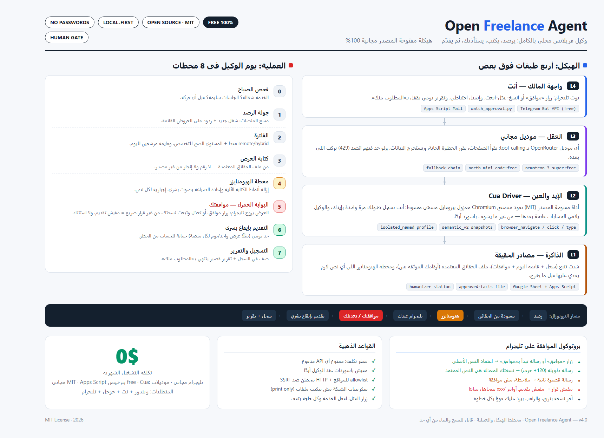

# Open Freelance Agent — الوكيل الحر المفتوح

**100% FREE | OPEN SOURCE | LOCAL-FIRST | NO PASSWORDS**

[](LICENSE)
[](docs/SETUP-AR.md)
[](https://openrouter.ai)
[](SECURITY.md)
[](docs/SETUP-AR.md)

<p align="center">
  
</p>


[](https://gitdiagram.com/omarhussien2/open-freelance-agent?utm_source=readme&utm_medium=picture)

وكيل محلي مجاني بالكامل (MIT) يراقب منصات العمل الحر (مستقل / Upwork / LinkedIn)، يفلتر المشاريع المناسبة (remote/hybrid وبالمستوى الوظيفي الصحيح)، ويكتب مسودة عرض من «ملف حقائق» معتمد فيه أرقامك الحقيقية فقط. لا يُرسل أي شيء قبل موافقتك: كل مسودة تصلك على بوت تليجرام من موبايلك — تعدّل النص أو تضغط زر الموافقة — وبعدها فقط يقدّم العرض عبر أتمتة متصفح محلية بإيقاع بشري، ويسجّل كل شيء في شيت جوجل مع تقرير يومي ينتهي دائمًا بـ«المطلوب منك».

[](https://gitdiagram.com/omarhussien2/open-freelance-agent?utm_source=readme&utm_medium=badge) 

## المعمارية في 4 سطور

1. **الدماغ (Brain):** أي موديل OpenRouter مجاني يدعم tool-calling — مُختبَر: `nemotron-3-super-120b:free`، والبديل `cohere/north-mini-code:free`.
2. **اليدان والعينان (Hands & Eyes):** Cua Driver (مفتوح المصدر، trycua/cua، MIT) يقود متصفح Chromium معزولًا ببروفايل دائم مسمّى — تسجّل الدخول بنفسك مرة واحدة، ولا تلمس كلمة السر الأداةَ أبدًا.
3. **الذاكرة (Memory):** شيت جوجل (تبويبات: السجل / قايمة اليوم / الموافقات) + Apps Script يرسل إيميلات الموافقة ويسجّلها.
4. **الواجهة (Interface):** بوت تليجرام مجاني للأبد (إعداد مرة واحدة من BotFather) — زر موافقة + تعديل بنسخ ولصق، وسكربت مراقبة دائم يرد بتأكيدات فورية دون استهلاك طابور التحديثات.

## رحلة العرض في 6 خطوات

```text
1) يرصد مشروعًا جديدًا أو ردًا      →  2) يفلتر: remote/hybrid + المستوى المناسب
3) يكتب مسودة من حقائقك الحقيقية   →  4) محطة Humanizer: نزع أي أثر للكتابة الآلية
5) البوابة الحمراء: المسودة على تليجرامك — عدّل أو وافق؛ لا موافقة = لا إرسال، أبدًا
6) تقديم آلي بإيقاع بشري (مثلًا: عرض/يوم) + سطر في الشيت + تقرير «المطلوب منك»
```

## ما تحتاجه

| المتطلب | التفاصيل |
| --- | --- |
| جهاز ويندوز | يعمل أثناء وقت المراقبة |
| إنترنت مستقر | — |
| حساب جوجل | لشيت الذاكرة + Apps Script |
| حساب تليجرام | لبوت الموافقات (مجاني عبر BotFather) |
| مفتاح OpenRouter | الموديلات المُختبرة مجانية (`:free`) |

**التكلفة الكاملة: 0.**

## ابدأ من هنا

| الملف | ماذا يحتوي |
| --- | --- |
| `docs/SETUP-AR.md` | دليل التركيب خطوة بخطوة لغير التقنيين |
| `docs/DAILY-SCHEDULE.md` | التشغيل اليومي: الطبقات الثلاث وكيف لا يسقط الوكيل أبدًا |
| `learning/` | طبقة التعلم الذاتي: قراءة الدروس قبل كل مهمة وكتابتها بعد كل تجربة |
| `docs/ARCHITECTURE.md` | المعمارية + المحطات الثماني + بروتوكول الموافقة |
| `SECURITY.md` | الأسرار، القوائم المسموحة، مفتاح الإيقاف، الحذف الكامل |
| `docs/INFRAGRAPHIC.png` | صورة المعمارية |

## English (short)

Open Freelance Agent is a 100% free, local-first, open-source (MIT) agent for freelancers.
It monitors Mostaql, Upwork, and LinkedIn, filters remote/hybrid work at your seniority
level, and drafts proposals from an approved facts file (real numbers only). Every draft
stops at a RED GATE: it reaches your Telegram bot, where you edit it or tap Approve —
last version wins, and no approval means no submission, ever. Approved offers are then
submitted through local browser automation (Cua Driver, MIT) at a human pace (e.g. 1
offer/day per platform), using a named persistent profile you logged into yourself once —
the agent never sees a password. Memory is a Google Sheet (log / shortlist / approvals
tabs) driven by Apps Script. Total cost: 0 — you need a Windows PC, internet, a Google
account, and a Telegram account. Nothing about you or your clients leaves your machine.

## الرخصة

MIT — انظر `LICENSE`. المشروع مجاني ومفتوح للأبد؛ لا اشتراك ولا حساب مدفوع.
